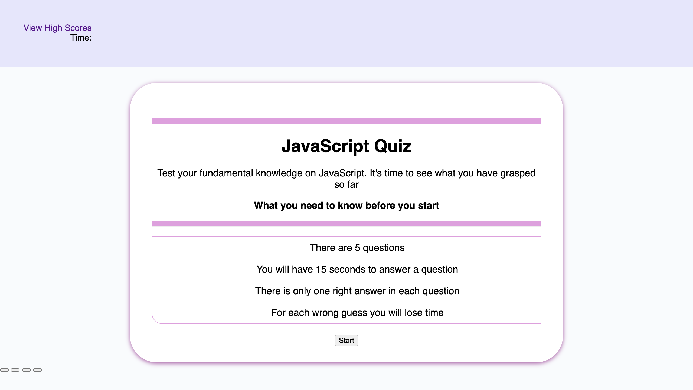

# JavaScript-Quiz

Creating a timed coding quiz testing users knowledge on Javascript. The quiz will include multiple choice question. When the user clicks chooses their answer, the next question gets displayed until the quiz is over. If the user chooses the wrong answer, they will be penalised by having their time deducted.

Why did I build this project?

I built this project from scratch so that I could apply the concepts of javascript that I have recently studied. Examples include: variables, functions, loops, if statements.

Motivation behind this?

This project would allow me to build on my studies and learn how code is written in jasavscript along side a html and css file. Specifically, understanding how interaction between a user and the browser works. My main focus being learning the logic behind creating certain functions to display certain outcomes.

What does this project solve?

This projects solves my ability in creating an interactive application on the browser with the skills I have learned so far. It also allows for anyone who is studying javascript to test their current knowledge on the topic by doing the quiz.

So far I have achieved?

1. When the user clicks the start button the quiz starts, and the contents of the landing page dissapear.

2. When the above action occurs, the timer begins to countdown from 60 seconds.

What I intend to add in the near future?

3. When the user has clicked the start button and the timer has started for the questions to be displayed along with options for answers to choose from.

4. When the user chooses 1 answer, for the next set of questions to be displayed.

5. Each time the user chooses the wrong answer for the time to be deducted by 10 seconds. Or for the quiz to end if they run out of time.

6. To add a final score card to display on the browser once all questions have been answered or time has run out.

7. To add a final Highscores card for the user to input their initials and have their scores saved.

Criteria set to achieve this are the following:

GIVEN I am taking a code quiz
WHEN I click the start button

THEN a timer starts and I am presented with a question

WHEN I answer a question
THEN I am presented with another question

WHEN I answer a question incorrectly
THEN time is subtracted from the clock

WHEN all questions are answered or the timer reaches 0
THEN the game is over

WHEN the game is over
THEN I can save my initials and my score

When you click the The start button the startQuiz function gets called.

Instalation

To access this project the following links are provided:

To access Github Repository

1. https://github.com/Farhiya1/JavaScript-Quiz

To access Application deployed at live URL

2. https://farhiya1.github.io/JavaScript-Quiz/

Screenshot changes made can be found in images
Screenshot of deployed application (Currently incomplete application)

References

1. https://javascript.info
2. https://birmingham.bootcampcontent.com/university-of-birmingham/
   UBHM-VIRT-FSF-PT-11-2021-U-LOL

3. https://coding-boot-camp.github.io/full-stack/github/
   professional-readme-guide

4. https://www.w3schools.com/js/js_loop_while.asp

5. https://www.javatpoint.com/random-string-generator-using-javascript

6. https://www.javascript.com/learn/conditionals

7. https://developer.mozilla.org/en-US/docs/Web/JavaScript/ReferenceStatements/if...else
